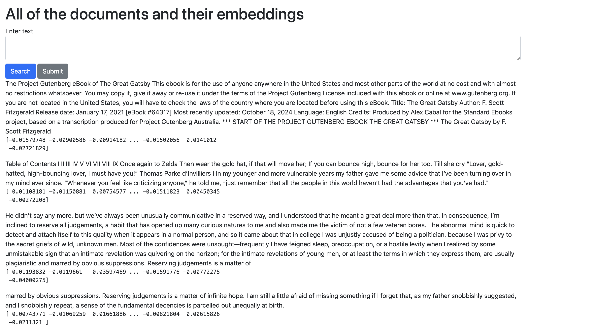

# PGVector Play

## Overview
This project is a Django-based web application with a PostgreSQL database with PGVector for similarity search and deployment using Docker. This project explores Django and PGVector, showcasing their capabilities in a containerised environment. It includes:

- A PostgreSQL database with pgvector for vector similarity.
- A Dockerised environment for ease of use.
- Automated dependency management using uv (*which I've become a big fan of recently*)

## Features
1. **Django Web Framework**: Powering the web application.
1. **Dockerised Environment**: Simplifies development and deployment.
1. **PostgreSQL with PGVector**: Enhancing search capabilities with vector similarity.
1. **Environment Variables**: Easy configuration using .env.


## Prerequisites
1. To run using the docker-compose command, please ensure you have [Docker](https://docs.docker.com/engine/install/) installed. Otherwise, ensure you have local or containerised installations of PostgreSQL and PGVector.

1. An OpenAI API Key is required for creating embeddings and similarity searches. You can get one [here](https://platform.openai.com/docs/quickstart).

## Setup Instructions
1. Clone the Repository:
```bash
git clone https://github.com/Uokoroafor/pgvector_django_play.git
cd basic_pgvector
```
2. Add Environment Variables
Create a `.env` file in the root directory and configure it. You can simply alter the `.env.sample` file and adjust the variables to your needs:
```env
OPENAI_API_KEY=<An OpenAI API Key>
DB_NAME="vector_db"
DB_USER="postgres"
DB_PASSWORD="password"
DB_HOST="localhost"
DB_PORT=5432
```

## Running the application:
There are two options here:
1. ### Running via Docker:
The easiest way is to run via docker. Use docker-compose to build and run the services:

```bash
docker-compose up --build
```
Adjust the ports in use as required. If no changes are made to `text_links.csv`, the container will download a free version of [The Great Gatsby](https://www.gutenberg.org/cache/epub/64317/pg64317.txt) from Project Gutenberg, chunk, embed it and load it into a Postgres database. 

2. ### Running Locally:
It is also possible to run locally. There are a few more initial setup steps.
- First create the require database (Note that vector_db and postgres below are used because they are the same as the environment variable.)
```sql
-- Connect to the default database (e.g., postgres) as a superuser
\c postgres;

-- Create a new database
CREATE DATABASE vector_db;

-- Connect to the newly created database
\c vector_db;

-- Enable the pgvector extension
CREATE EXTENSION IF NOT EXISTS vector;
```
- Install [uv](https://docs.astral.sh/uv/getting-started/installation/#pypi) which is used for dependency management either using curl or pip
- Install depedendencies using uv using the command below
```bash
uv install
```
- To load a text file, save it as .txt in `data` folder (you can also change this to a different location using the --folder flag) and run the below:
```bash
python3 load_texts.py
```
You can make more changes to chunk size and overlap with other flags. Inspect the file to learn more.
- Perform the Django DB Migrations:
```bash
python3 manage.py migrate
```
- Now you can run the application using the below commands:
```bash
python manage.py runserver
```


## Access the Application
Unless you adjust the ports, the Django application will be accessible by default at http://localhost:8000 and the PostgreSQL database will be exposed on port 5432.

## License
This project is licensed under the MIT License.

This was an interesting mini-project. I hope you get some utility from this. Please reach out with any issues or concerns.

## Screenshots



1. To find the chunk closest to the query text, click the search button. This is done via cosine similarity in PGVector
1. To add new text to the database, click the submit button.
